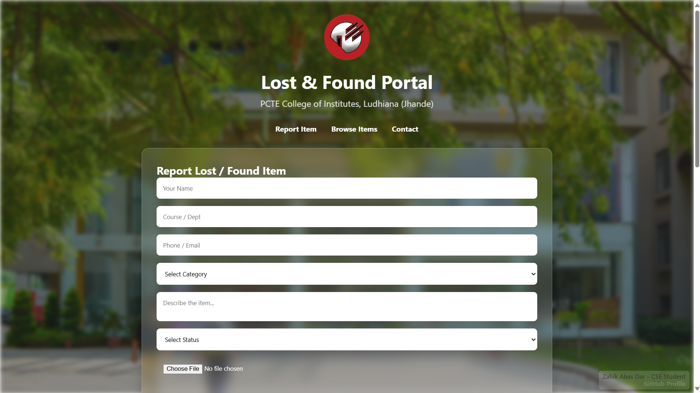
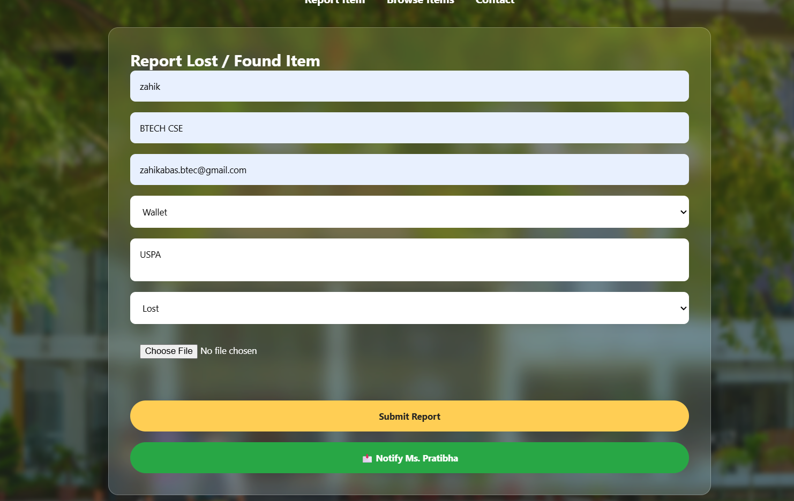

# 🏫 Lost & Found Portal - PCTE

[](LICENSE)  
[](https://github.com/ZahikAbasDar/lostfound-portal)  
[](https://github.com/ZahikAbasDar/lostfound-portal/issues)  
[](https://github.com/ZahikAbasDar/lostfound-portal/stargazers)

---

## 🚀 Overview

The **Lost & Found Portal** is a web application designed for **students, staff, and college authorities** at **PCTE College** to easily report, track, and retrieve lost or found items on campus.  

It features a **glassy UI**, **image upload support**, and **real-time browsing/searching of items**.  

 <!-- Replace with your GIF path -->

---

## 🎯 Features

- **Student Friendly:** Report lost/found items easily with description, category, image, and contact info.  
- **Admin Friendly:** Browse all reported items, search quickly, and track status.  
- **College Authority Friendly:** Maintain transparency and avoid item mismanagement.  
- **Responsive Design:** Works on desktop and mobile.  
- **Animated & Glassy UI:** Modern look with smooth transitions.  

---

## 💻 Tech Stack

- **Frontend:** HTML, CSS (Glassmorphism), JavaScript  
- **Backend:** Node.js, Express.js  
- **Database:** SQLite  
- **File Uploads:** Multer  
- **Hosting:** GitHub (static frontend & backend repo)  

---

## 📸 Screenshots

### Home Page


### Report Item Form


### Browse Items


---

## ⚡ Usage

1. **Clone the repository**
```bash
git clone https://github.com/ZahikAbasDar/lostfound-portal.git
cd lostfound-portal
